# Gemini Swarm Workflow Flowchart

This document provides a comprehensive visualization of the Gemini Swarm architecture and its two primary agent workflows: `swarm_dispatch` (quick parallel) and `swarm_plan_execute` (structured phases).

## Architectural Overview

The following Mermaid flowchart illustrates the interaction between the User Layer, the Orchestrator (MCP Server), the technical components, and the execution environment.

```mermaid
flowchart TD
    %% Subgraph: User Interface
    subgraph UserLayer [User Interface]
        User([User])
        MCPClient[MCP Client / Gemini CLI]
    end

    %% Subgraph: Orchestrator
    subgraph Orchestrator [Orchestrator - src/server.ts]
        direction TB
        
        subgraph ToolHandlers [Tool Handlers]
            Dispatch[swarm_dispatch]
            PlanExecute[swarm_plan_execute]
            Status[swarm_status]
            Results[swarm_results]
            Lock[swarm_lock]
            Unlock[swarm_unlock]
        end

        subgraph LoopLogic [Loops & Logic]
            Monitor[monitorAgent]
            Resolve[resolveFromRaw / resolveFromFile]
            HealthCheck[Health Check Loop]
            MsgHandler[Watcher.on 'message']
        end
    end

    %% Subgraph: Technical Components
    subgraph Components [Technical Components]
        direction TB
        Spawner[TmuxSpawner\ntmux-spawner.ts\n+parseStreamEvents\n+extractResponse]
        Tracker[AgentTracker\nagent-tracker.ts]
        Parser[PlanParser\nplan-parser.ts]
        Bus[MessageBus\nmessage-bus.ts]
        Watcher[InboxWatcher\ninbox-watcher.ts]
        Locker[LockManager\nlock-manager.ts]
    end

    %% Subgraph: Execution Environment
    subgraph ExecutionEnv [Execution Environment]
        subgraph TmuxWindow [Tmux Window / Sessions]
            Pane1[Agent Pane 1]
            Pane2[Agent Pane 2]
            PaneN[Agent Pane N]
        end
        Filesystem[(/tmp/gemini-swarm/)]
    end

    %% Flow: User to Orchestrator
    User -->|Tool Call| MCPClient
    MCPClient -->|JSON RPC| ToolHandlers

    %% Workflow: swarm_dispatch
    Dispatch -->|1. Register| Tracker
    Dispatch -->|2. Spawn| Spawner
    Spawner -->|3. split-window| Pane1
    Spawner -->|4. wait-for| Monitor
    Monitor -.->|Async Wait| Pane1
    Dispatch -->|5. Return Immediate| User

    %% Workflow: swarm_plan_execute
    PlanExecute -->|1. Parse plan.md| Parser
    PlanExecute -->|2. Mark in_progress| Parser
    PlanExecute -->|3. Register Tasks| Tracker
    PlanExecute -->|4. Spawn Agents| Spawner
    Spawner -->|5. Run Tasks| Pane2
    PlanExecute -->|6. Promise.all| Monitor
    Monitor -->|7. Process Completion| Resolve
    Resolve -->|8. Call Spawner Utils| Spawner
    Resolve -->|9. Update Status| Tracker
    PlanExecute -->|10. Update plan.md| Parser
    PlanExecute -->|11. Return Phase Summary| User

    %% Communication & Heartbeats
    Pane1 & Pane2 -->|Heartbeats / Msgs| Bus
    Bus -->|JSONL Write| Filesystem
    Watcher -->|fs.watch / Polling| Filesystem
    Watcher -->|Notify| MsgHandler
    MsgHandler -->|Read Inbox| Bus
    MsgHandler -->|Update Heartbeat| Tracker
    HealthCheck -->|Poll Tracker| Tracker
    Tracker -.->|Mark Unresponsive| Filesystem

    %% State & Persistence
    Status & Results -->|Query| Tracker
    Results -->|Read JSONL| Filesystem
    Locker -->|Check / Acquire Locks| Filesystem
    Parser <-->|Read / Write Markdown| Filesystem

    %% Styling
    classDef orchestrator fill:#f9f,stroke:#333,stroke-width:2px;
    classDef component fill:#bbf,stroke:#333,stroke-width:2px;
    classDef env fill:#dfd,stroke:#333,stroke-width:2px;
    class Orchestrator,ToolHandlers,LoopLogic orchestrator;
    class Components component;
    class ExecutionEnv env;
```

## Workflow Key Differences

| Feature | `swarm_dispatch` | `swarm_plan_execute` |
|---------|-------------------|-----------------------|
| **Goal** | Quick, ad-hoc parallel execution | Structured, phase-based execution |
| **Blocking** | Non-blocking (returns immediately) | Synchronous phase-gate (waits for phase) |
| **Tracking** | Manual status/results polling | Automatic `plan.md` status markers |
| **State** | In-memory `AgentTracker` | Persistent `plan.md` + `AgentTracker` |
| **Markers** | N/A | `[ ]` (Pending), `[~]` (Running), `[x]` (Done), `[!]` (Failed) |

## Component Roles

- **TmuxSpawner (`tmux-spawner.ts`)**: Manages the low-level lifecycle of agents within tmux panes using `split-window` and `wait-for`.
- **AgentTracker (`agent-tracker.ts`)**: The orchestrator's central source of truth for agent states, roles, and heartbeats.
- **PlanParser (`plan-parser.ts`)**: Specializes in reading and updating Conductor-style `plan.md` files for structured task decomposition.
- **MessageBus & InboxWatcher**: A file-based communication bridge allowing agents to send heartbeats and messages to the orchestrator.
- **LockManager (`lock-manager.ts`)**: Prevents race conditions by managing file-based locks for shared resource access.
